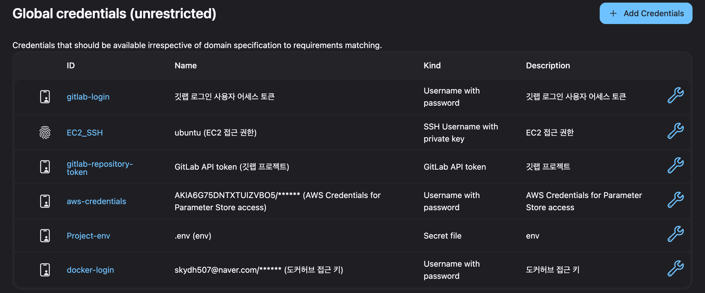

## 포팅 메뉴얼


### 1. 사용 도구

---
- 이슈 관리 : Jira , Notion
- 형상 관리 : GitLab
- 커뮤니케이션 : MatterMost, Notion
- 디자인 : Figma
- CI/CD : Jenkins, Docker
### 2. 개발 환경

---
### Frontend

- Flutter 
  -build.gradle 
``` groovy
plugins {
    id "com.android.application"
    id "kotlin-android"
    // The Flutter Gradle Plugin must be applied after the Android and Kotlin Gradle plugins.
    id "dev.flutter.flutter-gradle-plugin"
}

android {
    namespace = "com.example.frontend_app"
    compileSdk = flutter.compileSdkVersion
    ndkVersion = flutter.ndkVersion

    compileOptions {
        sourceCompatibility = JavaVersion.VERSION_1_8
        targetCompatibility = JavaVersion.VERSION_1_8
    }

    kotlinOptions {
        jvmTarget = JavaVersion.VERSION_1_8
    }

    defaultConfig {
        // TODO: Specify your own unique Application ID (https://developer.android.com/studio/build/application-id.html).
        applicationId = "com.example.frontend_app"
        // You can update the following values to match your application needs.
        // For more information, see: https://flutter.dev/to/review-gradle-config.
        minSdk = flutter.minSdkVersion
        targetSdk = flutter.targetSdkVersion
        versionCode = flutter.versionCode
        versionName = flutter.versionName
    }

    buildTypes {
        release {
            // TODO: Add your own signing config for the release build.
            // Signing with the debug keys for now, so `flutter run --release` works.
            signingConfig = signingConfigs.debug
        }
    }
}

flutter {
    source = "../.."
}
```
- androidmanifest.txt

``` 
<manifest xmlns:android="http://schemas.android.com/apk/res/android">
    <uses-permission android:name="android.permission.INTERNET"/>
    <!-- AndroidManifest.xml -->
    <uses-permission android:name="android.permission.READ_EXTERNAL_STORAGE"/>
    <uses-permission android:name="android.permission.CAMERA"/>

    <application
        android:label="frontend_app"
        android:name="${applicationName}"
        android:icon="@mipmap/ic_launcher"
        android:usesCleartextTraffic="true"
        android:enableOnBackInvokedCallback="true"
        >
        <activity
            android:name=".MainActivity"
            android:exported="true"
            android:launchMode="singleTop"
            android:taskAffinity=""
            android:theme="@style/LaunchTheme"
            android:configChanges="orientation|keyboardHidden|keyboard|screenSize|smallestScreenSize|locale|layoutDirection|fontScale|screenLayout|density|uiMode"
            android:hardwareAccelerated="true"
            android:windowSoftInputMode="adjustResize">
            <!-- Specifies an Android theme to apply to this Activity as soon as
                 the Android process has started. This theme is visible to the user
                 while the Flutter UI initializes. After that, this theme continues
                 to determine the Window background behind the Flutter UI. -->
            <meta-data
              android:name="io.flutter.embedding.android.NormalTheme"
              android:resource="@style/NormalTheme"
              />
            <intent-filter>
                <action android:name="android.intent.action.MAIN"/>
                <category android:name="android.intent.category.LAUNCHER"/>
            </intent-filter>
        </activity>
        <!-- Don't delete the meta-data below.
             This is used by the Flutter tool to generate GeneratedPluginRegistrant.java -->
        <meta-data
            android:name="flutterEmbedding"
            android:value="2" />
    </application>
    <!-- Required to query activities that can process text, see:
         https://developer.android.com/training/package-visibility and
         https://developer.android.com/reference/android/content/Intent#ACTION_PROCESS_TEXT.

         In particular, this is used by the Flutter engine in io.flutter.plugin.text.ProcessTextPlugin. -->
    <queries>
        <intent>
            <action android:name="android.intent.action.PROCESS_TEXT"/>
            <data android:mimeType="text/plain"/>
        </intent>
    </queries>
</manifest>
```

-  flutter-yaml
```yaml
name: frontend_app
description: "A new Flutter project."
# The following line prevents the package from being accidentally published to
# pub.dev using `flutter pub publish`. This is preferred for private packages.
publish_to: 'none' # Remove this line if you wish to publish to pub.dev


version: 1.0.0+1

environment:
  sdk: ^3.6.1

dependencies:
  flutter:
    sdk: flutter

  get: ^4.6.6
  provider: ^6.0.0
  http: ^1.3.0
  shared_preferences: ^2.5.1
  image_picker: ^1.1.2
  image: ^4.5.2
  # The following adds the Cupertino Icons font to your application.
  # Use with the CupertinoIcons class for iOS style icons.
  cupertino_icons: ^1.0.8
  path_provider: ^2.1.5

  cached_network_image: ^3.4.1
  lucide_icons: ^0.257.0
  daum_postcode_search: ^0.0.3 #도로명 주소 불러오기
  webview_flutter: ^4.10.0 #웹 페이지 불러오기

  flutter_dotenv: ^5.2.1 #env 파일 활용
  jwt_decoder: ^2.0.1 #jwt 일기
  jwt_decode: ^0.3.0
  auto_size_text: ^3.0.0
  nanoid:
  mime: ^2.0.0
  #채팅창
  stomp_dart_client: ^2.1.3
  web_socket_channel: ^3.0.2
  dio: ^5.8.0+1
dev_dependencies:
  flutter_test:
    sdk: flutter

  # The "flutter_lints" package below contains a set of recommended lints to
  # encourage good coding practices. The lint set provided by the package is
  # activated in the `analysis_options.yaml` file located at the root of your
  # package. See that file for information about deactivating specific lint
  # rules and activating additional ones.
  flutter_lints: ^5.0.0

# For information on the generic Dart part of this file, see the
# following page: https://dart.dev/tools/pub/pubspec

# The following section is specific to Flutter packages.
flutter:

  # The following line ensures that the Material Icons font is
  # included with your application, so that you can use the icons in
  # the material Icons class.
  uses-material-design: true
  assets:
    - assets/img/
    - assets/img/credit-card.png
    - assets/img/btnG_google.png
    - assets/img/btnG_naver.png
    - assets/img/food/
    - assets/json/home/
    - assets/json/shop/
    - assets/json/shop/category.json
    - assets/json/board/

    - assets/json/chat/chatroom.json

    - assets/daum_postcode.html
    - assets/env/.env
  fonts:
    - family: Nanum
      fonts:
        - asset: assets/fonts/NanumGothicCoding-Regular.ttf
        - asset: assets/fonts/NanumGothicCoding-Bold.ttf

    - family: Jalnan
      fonts:
        - asset: assets/fonts/Jalnan2TTF.ttf
```
- flutter env 파일
```
PORTONE_V2_SECRET_KEY=AI9SvYQRS81K5gCofCbq7KrGKffwgOQ8iydm1wnojx0nrbRw1OhFtvuJRQKoZGZ0do0eWFftgTNbCSRg
STORE_ID=store-f2d0472b-c8d3-47c5-8286-9931c7154dc2
NHN_KCP_CHANNEL_KEY=channel-key-be299b70-4e8d-495d-a840-9316fa2f985e

PORTONE_BASE_URL=https://api.portone.io
SERVER_BASE_URL=https://togethrebuy.com

NAVER_MEMBER_ACCESSTOKEN=-
GOOGLE_MEMBER_ACCESSTOKEN=-
```
- flutter setting.txt
```text
#pubspec:■■■■■■■■■■■■■■■

name: new_flutter
description: "A new Flutter project."
# The following line prevents the package from being accidentally published to
# pub.dev using `flutter pub publish`. This is preferred for private packages.
publish_to: 'none' # Remove this line if you wish to publish to pub.dev

# The following defines the version and build number for your application.
# A version number is three numbers separated by dots, like 1.2.43
# followed by an optional build number separated by a +.
# Both the version and the builder number may be overridden in flutter
# build by specifying --build-name and --build-number, respectively.
# In Android, build-name is used as versionName while build-number used as versionCode.
# Read more about Android versioning at https://developer.android.com/studio/publish/versioning
# In iOS, build-name is used as CFBundleShortVersionString while build-number is used as CFBundleVersion.
# Read more about iOS versioning at
# https://developer.apple.com/library/archive/documentation/General/Reference/InfoPlistKeyReference/Articles/CoreFoundationKeys.html
# In Windows, build-name is used as the major, minor, and patch parts
# of the product and file versions while build-number is used as the build suffix.
version: 1.0.0+1

environment:
  sdk: ^3.6.2

# Dependencies specify other packages that your package needs in order to work.
# To automatically upgrade your package dependencies to the latest versions
# consider running `flutter pub upgrade --major-versions`. Alternatively,
# dependencies can be manually updated by changing the version numbers below to
# the latest version available on pub.dev. To see which dependencies have newer
# versions available, run `flutter pub outdated`.
dependencies:
  flutter:
    sdk: flutter

  # The following adds the Cupertino Icons font to your application.
  # Use with the CupertinoIcons class for iOS style icons.
  cupertino_icons: ^1.0.8

dev_dependencies:
  flutter_test:
    sdk: flutter

  # The "flutter_lints" package below contains a set of recommended lints to
  # encourage good coding practices. The lint set provided by the package is
  # activated in the `analysis_options.yaml` file located at the root of your
  # package. See that file for information about deactivating specific lint
  # rules and activating additional ones.
  flutter_lints: ^5.0.0

# For information on the generic Dart part of this file, see the
# following page: https://dart.dev/tools/pub/pubspec

# The following section is specific to Flutter packages.
flutter:

  # The following line ensures that the Material Icons font is
  # included with your application, so that you can use the icons in
  # the material Icons class.
  uses-material-design: true

  # To add assets to your application, add an assets section, like this:
  # assets:
  #   - images/a_dot_burr.jpeg
  #   - images/a_dot_ham.jpeg

  # An image asset can refer to one or more resolution-specific "variants", see
  # https://flutter.dev/to/resolution-aware-images

  # For details regarding adding assets from package dependencies, see
  # https://flutter.dev/to/asset-from-package

  # To add custom fonts to your application, add a fonts section here,
  # in this "flutter" section. Each entry in this list should have a
  # "family" key with the font family name, and a "fonts" key with a
  # list giving the asset and other descriptors for the font. For
  # example:
  # fonts:
  #   - family: Schyler
  #     fonts:
  #       - asset: fonts/Schyler-Regular.ttf
  #       - asset: fonts/Schyler-Italic.ttf
  #         style: italic
  #   - family: Trajan Pro
  #     fonts:
  #       - asset: fonts/TrajanPro.ttf
  #       - asset: fonts/TrajanPro_Bold.ttf
  #         weight: 700
  #
  # For details regarding fonts from package dependencies,
  # see https://flutter.dev/to/font-from-package


#AndroidManifest:■■■■■■■■■■■■■■■

<manifest xmlns:android="http://schemas.android.com/apk/res/android">
    <application
        android:label="new_flutter"
        android:name="${applicationName}"
        android:icon="@mipmap/ic_launcher">
        <activity
            android:name=".MainActivity"
            android:exported="true"
            android:launchMode="singleTop"
            android:taskAffinity=""
            android:theme="@style/LaunchTheme"
            android:configChanges="orientation|keyboardHidden|keyboard|screenSize|smallestScreenSize|locale|layoutDirection|fontScale|screenLayout|density|uiMode"
            android:hardwareAccelerated="true"
            android:windowSoftInputMode="adjustResize">
            <!-- Specifies an Android theme to apply to this Activity as soon as
                 the Android process has started. This theme is visible to the user
                 while the Flutter UI initializes. After that, this theme continues
                 to determine the Window background behind the Flutter UI. -->
            <meta-data
              android:name="io.flutter.embedding.android.NormalTheme"
              android:resource="@style/NormalTheme"
              />
            <intent-filter>
                <action android:name="android.intent.action.MAIN"/>
                <category android:name="android.intent.category.LAUNCHER"/>
            </intent-filter>
        </activity>
        <!-- Don't delete the meta-data below.
             This is used by the Flutter tool to generate GeneratedPluginRegistrant.java -->
        <meta-data
            android:name="flutterEmbedding"
            android:value="2" />
    </application>
    <!-- Required to query activities that can process text, see:
         https://developer.android.com/training/package-visibility and
         https://developer.android.com/reference/android/content/Intent#ACTION_PROCESS_TEXT.

         In particular, this is used by the Flutter engine in io.flutter.plugin.text.ProcessTextPlugin. -->
    <queries>
        <intent>
            <action android:name="android.intent.action.PROCESS_TEXT"/>
            <data android:mimeType="text/plain"/>
        </intent>
    </queries>
</manifest>


#build.gradle■■■■■■■■■■■■■■■

plugins {
    id "com.android.application"
    id "kotlin-android"
    // The Flutter Gradle Plugin must be applied after the Android and Kotlin Gradle plugins.
    id "dev.flutter.flutter-gradle-plugin"
}

android {
    namespace = "com.example.new_flutter"
    compileSdk = flutter.compileSdkVersion
    ndkVersion = flutter.ndkVersion

    compileOptions {
        sourceCompatibility = JavaVersion.VERSION_1_8
        targetCompatibility = JavaVersion.VERSION_1_8
    }

    kotlinOptions {
        jvmTarget = JavaVersion.VERSION_1_8
    }

    defaultConfig {
        // TODO: Specify your own unique Application ID (https://developer.android.com/studio/build/application-id.html).
        applicationId = "com.example.new_flutter"
        // You can update the following values to match your application needs.
        // For more information, see: https://flutter.dev/to/review-gradle-config.
        minSdk = flutter.minSdkVersion
        targetSdk = flutter.targetSdkVersion
        versionCode = flutter.versionCode
        versionName = flutter.versionName
    }

    buildTypes {
        release {
            // TODO: Add your own signing config for the release build.
            // Signing with the debug keys for now, so `flutter run --release` works.
            signingConfig = signingConfigs.debug
        }
    }
}

flutter {
    source = "../.."
}


#local.properties■■■■■■■■■■■■■■■
sdk.dir=C:\\Users\\SSAFY\\AppData\\Local\\Android\\sdk
flutter.sdk=C:\\libraries\\flutter

```

- React
  - package.json 

```json
{
"name": "web-page",
"version": "0.1.0",
"private": true,
"dependencies": {
"@aws-sdk/client-ssm": "^3.744.0",
"axios": "^1.7.9",
"cra-template": "1.2.0",
"js-cookie": "^3.0.5",
"jwt-decode": "^4.0.0",
"lucide-react": "^0.474.0",
"react": "^19.0.0",
"react-cookie": "^7.2.2",
"react-dom": "^19.0.0",
"react-router-dom": "^7.1.5",
"react-scripts": "^5.0.1",
"recharts": "^2.15.1",
"web-vitals": "^4.2.4"
},
"scripts": {
"start": "react-scripts start",
"build": "react-scripts build",
"test": "react-scripts test",
"eject": "react-scripts eject"
},
"eslintConfig": {
"extends": [
"react-app",
"react-app/jest"
]
},
"browserslist": {
"production": [
">0.2%",
"not dead",
"not op_mini all"
],
"development": [
"last 1 chrome version",
"last 1 firefox version",
"last 1 safari version"
]
},
"devDependencies": {
"autoprefixer": "^10.4.20",
"postcss": "^8.5.1",
"tailwindcss": "^3.4.17"
}
}
```


### Backend
- IntelliJ
- mysql : 9.2.0
- mongoDB : 8.0.4
- Java 
    - Java OpenJDK : Amamzon Correto 21.0.6
    - SpringBoot : 3.4.1
    - Gradle : 8.12.1
#### 스프링 의존성(Build.gradle) 
- gateway gradle
``` groovy
plugins {
    id 'java'
    id 'war'
    id 'org.springframework.boot' version '3.4.2'
    id 'io.spring.dependency-management' version '1.1.7'
}

group = 'com.ssafy'
version = '0.0.1-SNAPSHOT'

java {
    toolchain {
        languageVersion = JavaLanguageVersion.of(21)
    }
}

configurations {
    compileOnly {
        extendsFrom annotationProcessor
    }
}

repositories {
    mavenCentral()
    maven { url 'https://repo.spring.io/milestone' }
}

ext {
    set('springCloudVersion', "2024.0.0")
}

dependencyManagement {
    imports {
        mavenBom "io.awspring.cloud:spring-cloud-aws-dependencies:3.0.0"
        mavenBom "org.springframework.cloud:spring-cloud-dependencies:${springCloudVersion}"
    }
}

dependencies {
    compileOnly 'org.projectlombok:lombok'
    annotationProcessor 'org.projectlombok:lombok'
    providedRuntime 'org.springframework.boot:spring-boot-starter-tomcat'
    testImplementation 'org.springframework.boot:spring-boot-starter-test'
    testImplementation 'org.springframework.security:spring-security-test'
    testRuntimeOnly 'org.junit.platform:junit-platform-launcher'

    implementation 'org.springframework.boot:spring-boot-starter-data-jpa'
    runtimeOnly 'com.mysql:mysql-connector-j'

    implementation 'org.springframework.boot:spring-boot-starter-security'

    //aws 관련
    implementation 'com.amazonaws:aws-java-sdk-s3:1.12.696'
    implementation 'io.awspring.cloud:spring-cloud-aws-starter-parameter-store'
    implementation 'org.springframework.cloud:spring-cloud-starter-aws:2.2.6.RELEASE'

    implementation 'io.jsonwebtoken:jjwt-api:0.11.5'
    runtimeOnly 'io.jsonwebtoken:jjwt-impl:0.11.5'
    runtimeOnly 'io.jsonwebtoken:jjwt-jackson:0.11.5'

    implementation 'io.github.cdimascio:dotenv-java:2.2.0'


    implementation 'org.springframework.cloud:spring-cloud-starter-gateway-mvc'
    providedRuntime 'org.springframework.boot:spring-boot-starter-tomcat'
    testImplementation 'org.springframework.boot:spring-boot-starter-test'
    testRuntimeOnly 'org.junit.platform:junit-platform-launcher'
}

dependencyManagement {
    imports {
        mavenBom "org.springframework.cloud:spring-cloud-dependencies:${springCloudVersion}"
    }
}

tasks.named('test') {
    useJUnitPlatform()
}
```
- chat 서버 gradle 
```groovy
plugins {
    id 'java'
    id 'war'
    id 'org.springframework.boot' version '3.4.1'
    id 'io.spring.dependency-management' version '1.1.7'
}

group = 'com.ssafy'
version = '0.0.1-SNAPSHOT'

java {
    toolchain {
        languageVersion = JavaLanguageVersion.of(21)
    }
}

configurations {
    compileOnly {
        extendsFrom annotationProcessor
    }
}

repositories {
    mavenCentral()
    maven { url 'https://repo.spring.io/milestone' }
}

dependencyManagement {
    imports {
        mavenBom "io.awspring.cloud:spring-cloud-aws-dependencies:3.0.0"
    }
}

dependencies {
    implementation 'org.springframework.boot:spring-boot-starter-data-jpa'
    implementation 'org.springframework.boot:spring-boot-starter-data-mongodb'
    implementation 'org.springframework.boot:spring-boot-starter-web'
    annotationProcessor 'jakarta.annotation:jakarta.annotation-api'
    annotationProcessor 'jakarta.persistence:jakarta.persistence-api'

    //aws 관련
    implementation 'com.amazonaws:aws-java-sdk-s3:1.12.696'
    implementation 'io.awspring.cloud:spring-cloud-aws-starter-parameter-store'
    implementation 'org.springframework.cloud:spring-cloud-starter-aws:2.2.6.RELEASE'

    compileOnly 'org.projectlombok:lombok'
    developmentOnly 'org.springframework.boot:spring-boot-devtools'
    runtimeOnly 'com.mysql:mysql-connector-j'
    annotationProcessor 'org.projectlombok:lombok'
    providedRuntime 'org.springframework.boot:spring-boot-starter-tomcat'
    testImplementation 'org.springframework.boot:spring-boot-starter-test'
    testRuntimeOnly 'org.junit.platform:junit-platform-launcher'

    // JWT handling 의존
    implementation 'io.jsonwebtoken:jjwt-api:0.11.5'
    runtimeOnly 'io.jsonwebtoken:jjwt-impl:0.11.5'
    runtimeOnly 'io.jsonwebtoken:jjwt-jackson:0.11.5'
    implementation 'org.springframework.boot:spring-boot-starter-validation'

    // queryDsl 의존성
    annotationProcessor "com.querydsl:querydsl-apt:5.0.0:jakarta"
    annotationProcessor "com.querydsl:querydsl-apt:${dependencyManagement.importedProperties['querydsl.version']}:jakarta"

    /////////////////////////////////////////////////////////////
    // WebSocket 의존성
    implementation 'org.springframework.boot:spring-boot-starter-websocket'

    // S3 의존성
    implementation 'com.amazonaws:aws-java-sdk-s3'

    // AWS SDK 의존성
    implementation 'com.amazonaws:aws-java-sdk-s3:1.12.125'
}

def querydslDir = layout.buildDirectory.dir("generated/querydsl").get().asFile
tasks.withType(JavaCompile).configureEach {
    options.generatedSourceOutputDirectory.set(querydslDir)
}
sourceSets {
    main.java.srcDirs += [querydslDir]
}

clean.doLast {
    file(querydslDir).deleteDir()
}


tasks.named('test') {
    useJUnitPlatform()
}

```
```groovy
plugins {
    id 'java'
    id 'war'
    id 'org.springframework.boot' version '3.4.1'
    id 'io.spring.dependency-management' version '1.1.7'
}

group = 'com.ssafy'
version = '0.0.1-SNAPSHOT'

java {
    toolchain {
        languageVersion = JavaLanguageVersion.of(21)
    }
}

configurations {
    compileOnly {
        extendsFrom annotationProcessor
    }
}

repositories {
    mavenCentral()
    maven { url 'https://repo.spring.io/milestone' }
}

dependencyManagement {
    imports {
        mavenBom "io.awspring.cloud:spring-cloud-aws-dependencies:3.0.0"
    }
}

dependencies {
    implementation 'org.springframework.boot:spring-boot-starter-data-jpa'
    implementation 'org.springframework.boot:spring-boot-starter-web'
    implementation 'org.springframework.boot:spring-boot-starter-actuator'
    annotationProcessor 'jakarta.annotation:jakarta.annotation-api'
    annotationProcessor 'jakarta.persistence:jakarta.persistence-api'
    // 스프링 시큐리티 스타터
    implementation 'org.springframework.boot:spring-boot-starter-security'
    implementation 'org.springframework.security:spring-security-oauth2-client'
    testImplementation 'org.springframework.security:spring-security-test'

    //aws 관련
    implementation 'com.amazonaws:aws-java-sdk-s3:1.12.696'
    implementation 'io.awspring.cloud:spring-cloud-aws-starter-parameter-store'
    implementation 'org.springframework.cloud:spring-cloud-starter-aws:2.2.6.RELEASE'

    compileOnly 'org.projectlombok:lombok'
    developmentOnly 'org.springframework.boot:spring-boot-devtools'
    runtimeOnly 'com.mysql:mysql-connector-j'
    annotationProcessor 'org.projectlombok:lombok'
    providedRuntime 'org.springframework.boot:spring-boot-starter-tomcat'
    testImplementation 'org.springframework.boot:spring-boot-starter-test'
    testRuntimeOnly 'org.junit.platform:junit-platform-launcher'


    // JWT handling 의존
    implementation 'io.jsonwebtoken:jjwt-api:0.11.5'
    runtimeOnly 'io.jsonwebtoken:jjwt-impl:0.11.5'
    runtimeOnly 'io.jsonwebtoken:jjwt-jackson:0.11.5'
    implementation 'org.springframework.boot:spring-boot-starter-validation'

    // queryDsl 의존성
    annotationProcessor "com.querydsl:querydsl-apt:5.0.0:jakarta"
    implementation 'com.querydsl:querydsl-jpa:5.0.0:jakarta'
    implementation 'com.querydsl:querydsl-core:5.0.0'
    annotationProcessor "com.querydsl:querydsl-apt:${dependencyManagement.importedProperties['querydsl.version']}:jakarta"
    annotationProcessor "jakarta.annotation:jakarta.annotation-api"
    annotationProcessor "jakarta.persistence:jakarta.persistence-api"

    // ouath2 facorty 의존 추가
    implementation 'org.springframework.security:spring-security-oauth2-jose'

    // port-one
    implementation 'io.portone:server-sdk:0.12.0'

    // 이메일 인증
    implementation group: 'org.springframework.boot', name: 'spring-boot-starter-mail', version: '3.0.5'
}

def querydslDir = layout.buildDirectory.dir("generated/querydsl").get().asFile
tasks.withType(JavaCompile).configureEach {
    options.generatedSourceOutputDirectory.set(querydslDir)
}
sourceSets {
    main.java.srcDirs += [querydslDir]
}

clean.doLast {
    file(querydslDir).deleteDir()
}


tasks.named('test') {
    useJUnitPlatform()
}
```
- main 서버 gradle 
```groovy
plugins {
    id 'java'
    id 'war'
    id 'org.springframework.boot' version '3.4.1'
    id 'io.spring.dependency-management' version '1.1.7'
}

group = 'com.ssafy'
version = '0.0.1-SNAPSHOT'

java {
    toolchain {
        languageVersion = JavaLanguageVersion.of(21)
    }
}

configurations {
    compileOnly {
        extendsFrom annotationProcessor
    }
}

repositories {
    mavenCentral()
    maven { url 'https://repo.spring.io/milestone' }
}

dependencyManagement {
    imports {
        mavenBom "io.awspring.cloud:spring-cloud-aws-dependencies:3.0.0"
    }
}

dependencies {
    implementation 'org.springframework.boot:spring-boot-starter-data-jpa'
    implementation 'org.springframework.boot:spring-boot-starter-web'
    implementation 'org.springframework.boot:spring-boot-starter-actuator'
    annotationProcessor 'jakarta.annotation:jakarta.annotation-api'
    annotationProcessor 'jakarta.persistence:jakarta.persistence-api'
    // 스프링 시큐리티 스타터
    implementation 'org.springframework.boot:spring-boot-starter-security'
    implementation 'org.springframework.security:spring-security-oauth2-client'
    testImplementation 'org.springframework.security:spring-security-test'

    //aws 관련
    implementation 'com.amazonaws:aws-java-sdk-s3:1.12.696'
    implementation 'io.awspring.cloud:spring-cloud-aws-starter-parameter-store'
    implementation 'org.springframework.cloud:spring-cloud-starter-aws:2.2.6.RELEASE'

    compileOnly 'org.projectlombok:lombok'
    developmentOnly 'org.springframework.boot:spring-boot-devtools'
    runtimeOnly 'com.mysql:mysql-connector-j'
    annotationProcessor 'org.projectlombok:lombok'
    providedRuntime 'org.springframework.boot:spring-boot-starter-tomcat'
    testImplementation 'org.springframework.boot:spring-boot-starter-test'
    testRuntimeOnly 'org.junit.platform:junit-platform-launcher'


    // JWT handling 의존
    implementation 'io.jsonwebtoken:jjwt-api:0.11.5'
    runtimeOnly 'io.jsonwebtoken:jjwt-impl:0.11.5'
    runtimeOnly 'io.jsonwebtoken:jjwt-jackson:0.11.5'
    implementation 'org.springframework.boot:spring-boot-starter-validation'

    // queryDsl 의존성
    annotationProcessor "com.querydsl:querydsl-apt:5.0.0:jakarta"
    implementation 'com.querydsl:querydsl-jpa:5.0.0:jakarta'
    implementation 'com.querydsl:querydsl-core:5.0.0'
    annotationProcessor "com.querydsl:querydsl-apt:${dependencyManagement.importedProperties['querydsl.version']}:jakarta"
    annotationProcessor "jakarta.annotation:jakarta.annotation-api"
    annotationProcessor "jakarta.persistence:jakarta.persistence-api"

    // ouath2 facorty 의존 추가
    implementation 'org.springframework.security:spring-security-oauth2-jose'

    // port-one
    implementation 'io.portone:server-sdk:0.12.0'

    // 이메일 인증
    implementation group: 'org.springframework.boot', name: 'spring-boot-starter-mail', version: '3.0.5'
}

def querydslDir = layout.buildDirectory.dir("generated/querydsl").get().asFile
tasks.withType(JavaCompile).configureEach {
    options.generatedSourceOutputDirectory.set(querydslDir)
}
sourceSets {
    main.java.srcDirs += [querydslDir]
}

clean.doLast {
    file(querydslDir).deleteDir()
}


tasks.named('test') {
    useJUnitPlatform()
}
```
- 그외 서버 gradle
```groovy
plugins {
    id 'java'
    id 'war'
    id 'org.springframework.boot' version '3.4.1'
    id 'io.spring.dependency-management' version '1.1.7'
}

group = 'com.ssafy'
version = '0.0.1-SNAPSHOT'

java {
    toolchain {
        languageVersion = JavaLanguageVersion.of(21)
    }
}

configurations {
    compileOnly {
        extendsFrom annotationProcessor
    }
}

repositories {
    mavenCentral()
    maven { url 'https://repo.spring.io/milestone' }
    maven { url 'https://jitpack.io' }
}

dependencyManagement {
    imports {
        mavenBom "io.awspring.cloud:spring-cloud-aws-dependencies:3.0.0"
    }
}

dependencies {
    implementation 'org.springframework.boot:spring-boot-starter-data-jpa'
    implementation 'org.springframework.boot:spring-boot-starter-web'
    implementation 'org.springframework.boot:spring-boot-starter-actuator'
    annotationProcessor 'jakarta.annotation:jakarta.annotation-api'
    annotationProcessor 'jakarta.persistence:jakarta.persistence-api'
    // 스프링 시큐리티 스타터
    implementation 'org.springframework.boot:spring-boot-starter-security'
    implementation 'org.springframework.security:spring-security-oauth2-client'
    testImplementation 'org.springframework.security:spring-security-test'

    //aws 관련
    implementation 'com.amazonaws:aws-java-sdk-s3:1.12.696'
    implementation 'io.awspring.cloud:spring-cloud-aws-starter-parameter-store'
    implementation 'org.springframework.cloud:spring-cloud-starter-aws:2.2.6.RELEASE'

    compileOnly 'org.projectlombok:lombok'
    developmentOnly 'org.springframework.boot:spring-boot-devtools'
    runtimeOnly 'com.mysql:mysql-connector-j'
    annotationProcessor 'org.projectlombok:lombok'
    providedRuntime 'org.springframework.boot:spring-boot-starter-tomcat'
    testImplementation 'org.springframework.boot:spring-boot-starter-test'
    testRuntimeOnly 'org.junit.platform:junit-platform-launcher'

    // JWT handling 의존
    implementation 'io.jsonwebtoken:jjwt-api:0.11.5'
    runtimeOnly 'io.jsonwebtoken:jjwt-impl:0.11.5'
    runtimeOnly 'io.jsonwebtoken:jjwt-jackson:0.11.5'
    implementation 'org.springframework.boot:spring-boot-starter-validation'

    // queryDsl 의존성
    annotationProcessor "com.querydsl:querydsl-apt:5.0.0:jakarta"
    implementation 'com.querydsl:querydsl-jpa:5.0.0:jakarta'
    implementation 'com.querydsl:querydsl-core:5.0.0'
    annotationProcessor "com.querydsl:querydsl-apt:${dependencyManagement.importedProperties['querydsl.version']}:jakarta"
    annotationProcessor "jakarta.annotation:jakarta.annotation-api"
    annotationProcessor "jakarta.persistence:jakarta.persistence-api"

    // ouath2 facorty 의존 추가
    implementation 'org.springframework.security:spring-security-oauth2-jose'

    // port-one
    // https://mvnrepository.com/artifact/com.github.iamport/iamport-rest-client-java
    implementation 'com.github.iamport:iamport-rest-client-java:0.2.22'
    // https://mvnrepository.com/artifact/com.squareup.retrofit2/adapter-rxjava2
    implementation 'com.squareup.retrofit2:adapter-rxjava2:2.9.0'
    // https://mvnrepository.com/artifact/com.google.code.gson/gson
    implementation 'com.google.code.gson:gson:2.12.1'
    // https://mvnrepository.com/artifact/com.squareup.okhttp3/okhttp
    implementation 'com.squareup.okhttp3:okhttp:4.9.3'
    // https://mvnrepository.com/artifact/com.squareup.retrofit2/converter-gson
    implementation 'com.squareup.retrofit2:converter-gson:2.3.0'
}

def querydslDir = layout.buildDirectory.dir("generated/querydsl").get().asFile
tasks.withType(JavaCompile).configureEach {
    options.generatedSourceOutputDirectory.set(querydslDir)
}
sourceSets {
    main.java.srcDirs += [querydslDir]
}

clean.doLast {
    file(querydslDir).deleteDir()
}


tasks.named('test') {
    useJUnitPlatform()
}

```
## 3. 환경 변수
- 백엔드 환경 변수
  - gateway application-delploy.yaml 
  ```yaml
    spring:
  config:
    import:
      - aws-parameterstore:/togetherBuy/common/
      - classpath:application-security-deploy.yml
  cloud:
    aws:
      region:
        static: ${AWS_REGION}
      credentials:
        access-key: ${AWS_ACCESS_KEY_ID}
        secret-key: ${AWS_SECRET_ACCESS_KEY}
    gateway:
      mvc:
        routes:
          # 빌링 서비스
          - id: billing_route
            uri: http://billing:8080           # Billing 서비스의 Docker Compose 서비스명
            predicates:
              - Path=/api/billing/**

          # 채팅 서비스
          - id: chat_route
            uri: http://chat:8080
            predicates:
              - Path=/api/chat/**

          # 알림 서비스
          - id: notification_route
            uri: http://notification:8080
            predicates:
              - Path=/api/notification/**

          # 그 외 모든 /api/** 요청 (로그인 요청 포함)는 Main 서비스로 라우팅
          - id: main_route
            uri: http://main:8080
            predicates:
              - Path=/api/**

          - id: oauth2_redirect_route
            uri: http://main:8080
            predicates:
              - Path=/login/oauth2/code/**
  datasource:
    url: ${db.url}
    username: ${db.username}
    password: ${db.password}
    driver-class-name: com.mysql.cj.jdbc.Driver
  jpa:
    show-sql: true
    hibernate:
      ddl-auto: none

  application:
    name: TogetherBuyGateway

  server:
    port: 8080
  ```
  - gate 외 공통 application-deploy.yaml  
  ```yaml
  spring:
  cloud:
    aws:
      region:
        static: ${AWS_REGION}
      credentials:
        access-key: ${AWS_ACCESS_KEY_ID}
        secret-key: ${AWS_SECRET_ACCESS_KEY}
  config:
    import:
      - aws-parameterstore:/togetherBuy/common/
      - classpath:application-security-deploy.yml

  application:
    name: TogetherBuyMain

  datasource:
    url: ${db.url}
    username: ${db.username}
    password: ${db.password}
    driver-class-name: com.mysql.cj.jdbc.Driver
  jpa:
    show-sql: true
    hibernate:
      ddl-auto: update

  mail:
    host: smtp.gmail.com
    port: 587
    username: ${google.mailID}
    password: ${google.mailPW}
    properties:
      mail.smtp.auth: true
      mail.smtp.starttls.enable: true
      mail.smtp.starttls.required: true
      mail.smtp.connectiontimeout: 5000
      mail.smtp.timeout: 5000
      mail.smtp.writetimeout: 5000

  servlet:
    multipart:
      enabled: true
      max-file-size: 10MB
      max-request-size: 10MB

  server:
  port: 8080
  logging:
  level:
  com.amazonaws: DEBUG
  io.awspring.cloud: DEBUG
  org.springframework.cloud.aws: DEBUG
  org.springframework.boot: INFO
  org.springframework: INFO
  org.springframework.security.oauth2: DEBUG

    cloud:
      aws:
      bucket-name: togetherbuy

  baseUrl: https://togethrebuy.com
  ```
- AWS Parameter Store 에서 application.yaml과 관련된 모든 환경변수들을 가짐.
```
AWS_ACCESS_KEY_ID=-
AWS_SECRET_ACCESS_KEY=-
AWS_REGION=ap-northeast-2
```
- flutter 환경 변수 
```text
PORTONE_V2_SECRET_KEY=-
STORE_ID=-
NHN_KCP_CHANNEL_KEY=-

PORTONE_BASE_URL=https://api.portone.io
SERVER_BASE_URL=https://togethrebuy.com

NAVER_MEMBER_ACCESSTOKEN=-
GOOGLE_MEMBER_ACCESSTOKEN=-
```
- React 환경 변수 env-config.js
```javascript
window._env_ = {
    REACT_APP_API_URL: "https://togethrebuy.com", // 배포 환경 API URL
    // 필요한 다른 환경 변수들 추가
    REACT_APP_GOOGLE_CLIENT_ID: "-",
    REACT_APP_NAVER_CLIENT_ID: "-"
  };
```

## 4. 젠킨스 
- 빌드 테스트 파이프라인 
```groovy
pipeline {
    agent any

    tools {
        jdk 'jdk_21_manual'
        gradle 'gradle-8.11.1'
        nodejs 'nodejs-23.7'
    }

    stages {
        stage('Checkout') {
            steps {
                git branch: 'develop',
                    credentialsId: 'gitlab-login',
                    url: 'https://lab.ssafy.com/s12-webmobile1-sub1/S12P11A501.git'
            }
        }

        stage('Load Env') {
            steps {
                script {
                    // Jenkins Credentials에 등록된 .env 파일을 DOTENV_FILE 변수로 가져옴
                    withCredentials([file(credentialsId: 'Project-env', variable: 'DOTENV_FILE')]) {
                        sh '''
                            # 기존 .env 파일이 있다면 삭제
                            rm -f .env
                            # 현재 워크스페이스 루트에 .env 파일 복사
                            cp $DOTENV_FILE .env
                        '''
                        echo ".env file copied to workspace."
                    }
                }
            }
        }
        stage('Build & Test React') {
            steps {
                script {
                    dir("FE/Web/web-page") {
                        // 환경 변수 추가 (필요한 경우)
                        def envVars = []
                        envVars.add("CI=false")  // React 빌드시 CI 환경 오류 방지
                        withEnv(envVars) {
                            sh '''
                                npm ci  # 패키지 설치
                                npm run build  # React 빌드
                            '''
                        }
                    }
                }
            }
        }

        stage('Build & Test All MSA') {
            steps {
                script {
                    def msaList = [
                        'TogetherBuyMain',
                        'TogetherBuyBilling',
                        'TogetherBuyChat',
                        'TogetherBuyNotification',
                        'TogetherBuyGateway'
                    ]

                    // 병렬로 각 MSA 빌드 및 테스트 진행
                    Map<String, Closure> parallelStages = [:]
                    msaList.each { serviceName ->
                        parallelStages["Build_Test_${serviceName}"] = {
                            stage("Build & Test ${serviceName}") {
                                // 각 서비스의 경로로 이동 (예: workspace/BE/TogetherBuyMain)
                                dir("BE/${serviceName}") {
                                    // 워크스페이스 루트에 복사된 .env 파일을 읽어 각 줄을 환경 변수 형식으로 파싱
                                    def envVars = []
                                    def envFileContent = readFile file: "../../.env"
                                    envFileContent.split("\n").each { line ->
                                        line = line.trim()
                                        if (line && !line.startsWith("#") && line.contains("=")) {
                                            // withEnv에서는 "KEY=value" 형식의 문자열 리스트가 필요합니다.
                                            envVars.add(line)
                                        }
                                    }
                                    envVars.add("SPRING_CONFIG_LOCATION=classpath:/application-deploy.yml")
                                    // withEnv 블록 내에서 Gradle 빌드가 실행되면, 해당 환경변수들이 적용됨
                                    withEnv(envVars) {
                                        sh '''
                                            gradle clean build
                                        '''
                                    }
                                }
                            }
                        }
                    }
                    // 각 MSA 빌드를 병렬로 실행
                    parallel parallelStages
                }
            }
        }
    }

    post {
        always {
            echo "Pipeline has finished. Check the build and test results."
        }
    }
}

```
- 배포 파이프라인 
```groovy
pipeline {
    agent any

    tools {
        jdk 'jdk_21_manual'
        gradle 'gradle-8.11.1'
        nodejs 'nodejs-23.7'
    }

    // environment 블록: Jenkins "환경 변수"를 선언
    environment {
        // 환경 변수는 문자열로 선언하는 것이 안전
        IS_MERGE_REQUEST = 'false'
        SOURCE_BRANCH = ''
        TARGET_BRANCH = ''
    }

    stages {
        stage('Determine Branch') {
            steps {
                script {
                    // GitLab에서 넘어온 env.gitlabSourceBranch가 있는지 확인
                    if (env.gitlabSourceBranch) {
                        // MR 로직
                        env.IS_MERGE_REQUEST = 'true'
                        env.SOURCE_BRANCH = env.gitlabSourceBranch
                        env.TARGET_BRANCH = env.gitlabTargetBranch
                        echo "Merge Request detected: ${env.SOURCE_BRANCH} -> ${env.TARGET_BRANCH}"
                    } else {
                        // GitLab이 아닌 '수동 빌드'나 '일반 push' 상황
                        env.IS_MERGE_REQUEST = 'false'

                        // 원하면 수동 빌드 시에 env.GIT_BRANCH 등을 SOURCE_BRANCH에 할당해도 됨
                        if (env.GIT_BRANCH) {
                            env.SOURCE_BRANCH = env.GIT_BRANCH
                            echo "Manual or regular push on branch: ${env.SOURCE_BRANCH}"
                        } else {
                            echo "Manual build with no git branch info"
                        }
                    }
                }
            }
        }

        stage('Checkout') {
            steps {
                script {
                    // env.IS_MERGE_REQUEST는 문자열 'true' / 'false'로 저장됨
                    def branchToCheckout = (env.IS_MERGE_REQUEST == 'true') ? env.SOURCE_BRANCH : 'develop'

                    // 🔥 MR이 Closed된 경우(예: GitLab) 로직
                    // (수동 빌드 시 gitlabActionType이 없을 수도 있음)
                    if (env.IS_MERGE_REQUEST == 'false' && env.gitlabActionType == 'CLOSED') {
                        echo "Skipping build: MR closed without merging."
                        currentBuild.result = 'SUCCESS'
                        return
                    }

                    git branch: branchToCheckout,
                        credentialsId: 'gitlab-login',
                        url: 'https://lab.ssafy.com/s12-webmobile1-sub1/S12P11A501.git'
                }
            }
        }

        stage('Load Env') {
            steps {
                script {
                    withCredentials([file(credentialsId: 'Project-env', variable: 'DOTENV_FILE')]) {
                        sh '''
                            rm -f .env
                            cp $DOTENV_FILE .env
                        '''
                        echo ".env file copied to workspace."
                    }
                }
            }
        }

        stage('Build & Test React') {
            steps {
                script {
                    dir("FE/Web/web-page") {
                        def envVars = []
                        envVars.add("CI=false")  
                        withEnv(envVars) {
                            sh '''
                                npm ci  
                                npm run build  
                            '''
                        }
                    }
                }
            }
        }

        stage('Build & Test All MSA') {
            steps {
                script {
                    def msaList = [
                        'TogetherBuyMain',
                        'TogetherBuyBilling',
                        'TogetherBuyChat',
                        'TogetherBuyNotification',
                        'TogetherBuyGateway'
                    ]

                    Map<String, Closure> parallelStages = [:]
                    msaList.each { serviceName ->
                        parallelStages["Build_Test_${serviceName}"] = {
                            stage("Build & Test ${serviceName}") {
                                dir("BE/${serviceName}") {
                                    def envVars = []
                                    def envFileContent = readFile file: "../../.env"
                                    envFileContent.split("\n").each { line ->
                                        line = line.trim()
                                        if (line && !line.startsWith("#") && line.contains("=")) {
                                            envVars.add(line)
                                        }
                                    }
                                    envVars.add("SPRING_CONFIG_LOCATION=classpath:/application-deploy.yml")
                                    withEnv(envVars) {
                                        sh '''
                                            gradle clean build -x test
                                        '''
                                    }
                                }
                            }
                        }
                    }
                    parallel parallelStages
                }
            }
        }
    }

    post {
        always {
            echo "Pipeline has finished. Check the build and test results."
        }
    }
}
```

- Credentials

  1. 깃랩 사용자 access Token
  2. EC2 접근 권한 
  3. 깃랩 레포지토리 접근 토큰 
  4. aws - credentials 토큰
  5. env 
  6. 도커 허브 접근 키

## 5. 도커 
- 젠킨스 컨테이너 실행 
```Docker
docker run -d -p 9090:8080 -e JENKINS_OPTS="--prefix=/jenkins" -v /home/ubuntu/jenkins_home:/var/jenkins_home custom-jenkins
```
- mysql 컨테이너 실행 
```Dokcer
docker run -d -p 3306:3306 -v ~/mysql-data:/var/lib/mysql mysql
docker exec -it container mysql -u root -p
```
- mongodb 컨테이너 실행
```Docker
docker run -d \
  --name mongodb \
  -p 27017:27017 \
  -v mongodb_data:/data/db \
  mongo:latest
```
- 스프링 MSA Docker Compose 파일 
```yaml
services:
  service1:
    image: stussyhunter/togetherbuygateway:latest
    container_name: gateway
    ports:
      - "8080:8080"
    networks:
      - spring-msa-network
    env_file:
      - .env

  service2:
    image: stussyhunter/togetherbuymain:latest
    container_name: main
    ports:
      - "8081:8080"  # 외부 포트 8081로 노출되지만, 내부는 8080
    networks:
      - spring-msa-network
    env_file:
      - .env

  service3:
    image: stussyhunter/togetherbuybilling:latest
    container_name: billing
    ports:
      - "8082:8080"  # 외부 8082, 내부 8080
    networks:
      - spring-msa-network
    env_file:
      - .env

  service4:
    image: stussyhunter/togetherbuychat:latest
    container_name: chat
    ports:
      - "8083:8080"  # 외부 8083, 내부 8080
    networks:
      - spring-msa-network
    env_file:
      - .env

  service5:
    image: stussyhunter/togetherbuynotification:latest
    container_name: notification
    ports:
      - "8084:8080"  # 외부 8084, 내부 8080
    networks:
      - spring-msa-network
    env_file:
      - .env

  frontend:
    image: stussyhunter/togetherbuy-web:latest
    container_name: seller
    command: sh -c "tar -xzf /app/build.tar.gz -C /var/www/html/ && echo 'Frontend deployed!'"
    volumes:
      - /var/www/html:/var/www/html
    restart: on-failure
    networks:
      - spring-msa-network

networks:
  spring-msa-network:
```
- 스프링 Dockerfile
```Dockerfile
FROM openjdk:21-slim AS builder

RUN apt-get update && apt-get install -y \
    unzip \
 && rm -rf /var/lib/apt/lists/*
 
WORKDIR /app

COPY gradlew settings.gradle build.gradle ./
COPY gradle/ gradle/

RUN chmod +x gradlew

COPY . .

RUN ./gradlew --no-daemon clean build -x test

FROM openjdk:21-slim AS runner

WORKDIR /app

COPY --from=builder /app/build/libs/*.war app.war

EXPOSE 8081

ENTRYPOINT ["java", "-jar", "/app/app.war", "--spring.config.location=/app/application-deploy.yml"]
```

- react Dockerfile
```Docker
# ⚡ 1. React 빌드 단계
FROM node:18-alpine AS builder

WORKDIR /app

# package.json만 복사 후 의존성 설치 (최적화)
COPY package.json package-lock.json ./
RUN npm ci --production

# 소스 코드 복사 후 빌드 실행
COPY . .
RUN npm run build

# 🏃‍♂️ 2. EC2에서 사용할 배포용 컨테이너
FROM alpine:latest

# 빌드 결과물을 /var/www/html/로 복사하기 위해 tar 사용
WORKDIR /app
COPY --from=builder /app/build /app/build
RUN tar -czf build.tar.gz -C /app/build .

CMD ["sh", "-c", "echo 'React build files are ready. Copy build.tar.gz to EC2 and extract to /var/www/html/'"]

```
### 6. Nginx

- 시스템 업데이트 및 Nginx 설치
```
sudo apt-get update
sudo apt-get upgrade
sudo apt-get install nginx
```
- Nginx 시작 및 활성화 
```
sudo service nginx start
sudo service nginx status
```

- SSL 인증서 발급 
```
# snap을 이용하여 core 설치 -> snap을 최신 버전으로 유지하기 위해 설치
sudo snap install core

# core를 refresh 해준다.
sudo snap refresh core

# 기존에 잘못된 certbot이 설치되어있을 수도 있으니 삭제 해준다.
sudo apt-get remove certbot

# certbot 설치
sudo snap install --classic certbot

# certbot 명령을 로컬에서 실행할 수 있도록 snap의 certbot 파일을 로컬의 cerbot과 링크(연결) 시켜준다. -s 옵션은 심볼릭링크를 하겠다는 것.
ln -s /snap/bin/certbot /usr/bin/certbot
```
- Nginx 세팅 (https 적용 및 포워딩)
```
# HTTP 요청은 HTTPS로 리다이렉트
server {
    listen 80;
    server_name togethrebuy.com;

    # 모든 요청을 HTTPS로 리다이렉트 (요청 URI 유지)
    return 301 https://$host$request_uri;
}

server {
    listen 443 ssl;
    server_name togethrebuy.com;

    ssl_certificate     /etc/letsencrypt/live/togethrebuy.com/fullchain.pem;
    ssl_certificate_key /etc/letsencrypt/live/togethrebuy.com/privkey.pem;

    # 공통 CORS 헤더 적용
    add_header 'Access-Control-Allow-Origin' '*' always;
    add_header 'Access-Control-Allow-Methods' 'GET, POST, PUT, DELETE, OPTIONS' always;
    add_header 'Access-Control-Allow-Headers' 'Origin, Content-Type, Accept, Authorization, X-Requested-With' always;
    add_header 'Access-Control-Allow-Credentials' 'true' always;

    # OPTIONS 요청 처리 및 프론트엔드 정적 파일 서비스 (중복 제거)
    location / {
        root /var/www/html;    # 프론트엔드 빌드 파일이 위치한 디렉토리로 변경하세요.
        index index.html;
        try_files $uri /index.html;

        if ($request_method = 'OPTIONS') {
            return 204;
        }
    }

    # 백엔드 API 프록시 설정 (예: 백엔드 서버가 8080 포트에서 동작)
    location /api {
        proxy_pass http://127.0.0.1:8080;
        proxy_set_header Host $host;
        proxy_set_header X-Real-IP $remote_addr;
        proxy_set_header X-Forwarded-For $proxy_add_x_forwarded_for;
        proxy_set_header X-Forwarded-Proto https;
    }

    # Jenkins 프록시 설정 (예: Jenkins가 9090 포트에서 동작)
    location /jenkins {
        proxy_pass http://127.0.0.1:9090;
        proxy_set_header Host $host;
        proxy_set_header X-Real-IP $remote_addr;
        proxy_set_header X-Forwarded-For $proxy_add_x_forwarded_for;
        proxy_set_header X-Forwarded-Proto https;
    }

    # 소셜 로그인 리다이렉트도 Gateway를 거치도록 추가
    location /login/oauth2/code/ {
        proxy_pass http://127.0.0.1:8080;
        proxy_set_header Host $host;
        proxy_set_header X-Real-IP $remote_addr;
        proxy_set_header X-Forwarded-For $proxy_add_x_forwarded_for;
        proxy_set_header X-Forwarded-Proto https;
    }

    # 소셜 로그인 요청을 8081 포트로 포워딩
    location ~* ^/oauth2/authorization/(google|naver) {
        proxy_pass http://127.0.0.1:8081;
        proxy_set_header Host $host;
        proxy_set_header X-Real-IP $remote_addr;
        proxy_set_header X-Forwarded-For $proxy_add_x_forwarded_for;
        proxy_set_header X-Forwarded-Proto https;
    }

    # WebSocket 프록시 설정
    location /ws/ {
        proxy_pass http://127.0.0.1:8083;
        proxy_http_version 1.1;
        proxy_set_header Upgrade $http_upgrade;
        proxy_set_header Connection "Upgrade";
        proxy_set_header Host $host;
        proxy_set_header X-Real-IP $remote_addr;
        proxy_set_header X-Forwarded-For $proxy_add_x_forwarded_for;
    }
}
```